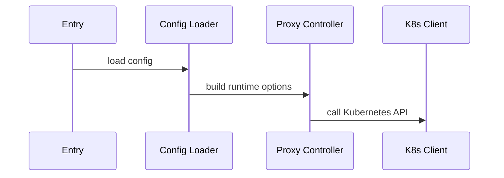

# chat

# Q1

```
今天我在公司使用ai agent（claude code接入公司内部模型）解决容器化网络代理的一个问题时，遇到了一些困境，主要体现在如下方面： 1、一个问题是 context太长，特别是在问答后期，经常遇到内部模型报错超出context windows 而无法输出回答，导致浪费此次输出、我不得不回滚并压缩上下文后重新提问； 2、因为上下文超出限制导致我不得不经常手动 compact，进而前几轮中已经阅读过的代码或者是模型输出的文档，出现遗忘导致不得不反复重新读取相关代码、甚至是模型自己输出的文档； 3、重要的事情是，中间遇到了模型给出问题错误猜测原因的现象，进而导致我走偏了，最终是通过捕捉模型输出的核心配置文件目录，我到环境上取下来检查发现模型走向了错误的道路，其实这个失误本可以杜绝，如果模型在给出猜测性原因之前，首先向我索要真实（问题）环境的关键配置文件、运行日志，就可以避免，实际上我也是通过将配置及日志下载到本地后告诉模型后重新分析回到正轨的； 4、claude code倒是在探索现有代码阶段，使用了explore subagent进行探索，一定程度减轻了主agent上下文压力，但是后续在生成代码时、在我让它生成 功能块的代码调用链流程的文档时、包括输出实施方案文档时，使用的好像是 主agent，这样占据了大量上下文； 5、一般来说简单问题我是可以接受agent直接动手修改代码的，但是像此类疑难问题、特别是我不熟悉代码功能时（实际上我们部门有许多新同事，他们并不熟悉现有代码功能），我更希望并且值得重视的是希望模型能够输出 现有功能的详细调用链（结合到源文件、方法、源代码块）文档、原因分析与建议修复方案（并进行横向比较）的文档、以及最后由我敲定后输出 实现规格与方案细节文档（要做到agent能够参考此文档反复运行都能生成相同代码），这样也能做好知识资产化； 6、落地到参考规格与方案细节文档，进行代码编写后，我遇到了模型生成的 go语言代码连编译都无法通过，说明它自己根本没有检查，其实原因是因为公司的 k8s上方件版本使用的是比较旧的、有些方法不存在，所以我认为模型对自己实现的代码需要进行至少是编译自验证； 7、在我告诉它编译问题后，它修复了代码实现，但实际上 规格与方案细节文档是有问题的，所以我希望模型在修复代码时，及时提问我让我授权它修改错误的文档； 8、代码提交后，我使用了另一个agent去对新增代码进行 review，其中发现了3个问题，其实我希望能够在代码开发完成后，是否可以让另一个子agent去检查增量代码，检查它是否按照规格设计文档实现，检查出的代码问题，反馈给实现代码编写的agent，甚至可以让它们对峙，以说明 检查子agent 哪些 issue是无效的（说明真实有效的理由）、哪些是真正需要修复的 像类似于上述场景的问题，我可以采取什么措施解决，应用什么通用技术，使得使用ai agent（无论是 codex，还是 claude code，又或者是 opencode）能够有效避免这些困境，提高准确率与效率呢？
```

# A1

我会把你的 8 个痛点抽象成一套“AI Agent 工程化工作流”：上下文治理、证据优先、规格文档、自动验证、多 Agent 评审闭环。接下来我会结合目前主流工具的官方能力，给你一套可直接落地到团队的做法。

我先抓到了一个核心结论：你遇到的不是“某个模型不够聪明”这么简单，而是缺少一套围绕 Agent 的工程流程约束。尤其是疑难问题里，Agent 必须先拿证据，再建假设，再改代码。

已思考 38s

你的判断非常对：这不是“换一个更强模型”就能完全解决的问题，而是要把 AI Agent 当成**需要工程约束的开发成员**来管理。尤其是你这种“容器化网络代理 / Kubernetes / Go / 公司内部旧版本依赖 / 线上环境差异”的疑难问题，最怕 Agent 在证据不足时一路猜下去，猜错了还显得很自信——这就很“AI 版带偏新人”。

我建议你把流程升级成下面这套：**证据优先 + 文档资产化 + 分阶段授权 + 自动验证 + 多 Agent 互审**。

------

## 一、先给结论：你要建立“Agent 疑难问题处理协议”

以后遇到复杂问题，不要直接说：

> 帮我分析并修复这个问题。

而是让 Agent 进入一个明确模式：

> 你现在进入疑难问题排查模式。
>  在没有真实环境配置、运行日志、版本信息、关键代码调用链之前，不允许给出确定性根因。
>  你必须先列出需要我提供的证据，再进行假设分级、代码阅读、方案比较、规格设计、实现、自验证和评审闭环。

核心思想是：

> **Agent 不应该先猜原因，而应该先建立证据链。**

这能直接解决你第 3 点提到的“模型错误猜测导致走偏”的问题。

------

## 二、把上下文从“聊天记录”迁移到“项目文档”

你遇到的 context 爆炸，本质原因是：你把“长期记忆”放在了聊天窗口里。

正确做法是把上下文拆成几个仓库内文档，让 Agent 每一轮只读取必要文档，而不是依赖聊天历史。

建议在项目里建立：

```
docs/agent/
  00-problem-brief.md              # 问题背景、现象、影响范围
  01-env-evidence.md               # 真实环境证据：配置、日志、版本、部署信息
  02-code-call-chain.md             # 现有代码调用链：文件、方法、关键代码块
  03-root-cause-analysis.md         # 根因假设、证据、排除项、最终结论
  04-solution-options.md            # 多种修复方案横向比较
  05-implementation-spec.md         # 最终实现规格，要求可重复生成一致代码
  06-verification-report.md         # 编译、测试、自验证结果
  07-review-report.md               # Review Agent 发现的问题与处理结论
  08-change-log.md                  # 本次改动决策记录
```

这样每次 compact、clear、换 Agent、换工具，都不会丢失关键知识。聊天窗口只是“临时工作台”，这些文档才是“事实数据库”。

Claude Code 官方文档也强调 context window 会包含指令、读取过的文件、模型回复等内容，长任务中要主动管理上下文；它也支持通过 `CLAUDE.md` 做项目记忆、用 subagent 隔离上下文、用 hooks 执行生命周期命令。 Codex 官方也支持用 `AGENTS.md` 给项目提供稳定指令，OpenCode 也支持 `AGENTS.md`、自定义 agents、commands、compaction、LSP 等配置。

------

## 三、每个复杂问题分成 8 个阶段，不允许 Agent 跳级

你可以把工作流固定成这样：

| 阶段         | 目标                                  | 是否允许改代码     |
| ------------ | ------------------------------------- | ------------------ |
| 1. Intake    | 收集问题现象、环境、版本、日志、配置  | 否                 |
| 2. Explore   | 只读探索代码，输出调用链文档          | 否                 |
| 3. Diagnose  | 基于证据提出根因假设，分级排序        | 否                 |
| 4. Compare   | 给出多个修复方案并横向比较            | 否                 |
| 5. Spec      | 生成实现规格文档，由你确认            | 否                 |
| 6. Implement | 严格按规格改代码                      | 是                 |
| 7. Verify    | 编译、单测、静态检查、自验证          | 只允许修复验证问题 |
| 8. Review    | 另一个 Agent 审查增量代码和规格一致性 | 否，除非你授权     |

这个流程能解决你提到的几个痛点：

第 1、2 点：上下文太长、compact 后遗忘
 → 每个阶段产出文档，下一阶段只读文档，不依赖聊天历史。

第 3 点：模型猜错原因
 → 阶段 1 强制收集真实配置、日志、版本，不允许先下结论。

第 4 点：主 Agent 被大量代码和文档撑爆
 → Explore、Review、Verify 都交给子 Agent，主 Agent 只维护决策状态。

第 5 点：希望沉淀知识资产
 → 调用链、根因分析、方案比较、实现规格全部成为仓库文档。

第 6 点：Go 代码编译不过
 → Implement 之后必须进入 Verify 阶段，没通过不算完成。

第 7 点：修了代码但规格文档没更新
 → 建立“代码-规格一致性检查”，代码修复影响规格时必须请求你授权更新文档。

第 8 点：希望另一个 Agent review 并对峙
 → 建立 Reviewer Agent 和 Implementer Agent 的争议处理协议。

------

## 四、疑难问题必须使用“证据矩阵”，禁止裸猜

你可以要求 Agent 所有根因分析都必须用这个格式：

```
## 根因假设矩阵

| 假设 | 支持证据 | 反驳证据 | 还缺什么证据 | 置信度 | 下一步验证 |
|---|---|---|---|---|---|
| H1: 配置未生效 | xxx日志显示... | yyy配置显示... | 需要真实部署配置 | 中 | 检查 ConfigMap/启动参数 |
| H2: 旧版 k8s API 不支持 | go.mod 显示版本... | 暂无 | 需要确认依赖源码 | 高 | grep 对应方法是否存在 |
| H3: 代码调用链未走到目标逻辑 | 日志没有出现... | ... | 需要调用链文档 | 中 | 添加/查找日志点 |
```

并加一条硬规则：

```
没有真实证据时，只能输出“假设”，不能输出“结论”。
每个结论必须指向至少一个证据来源：日志、配置、代码、版本、命令输出或复现实验。
```

这条规则很关键。它能把 Agent 从“像个算命先生”拉回到“像个工程师”。

------

## 五、为 Agent 建立项目级规则文件

你可以在仓库根目录放 `AGENTS.md`，同时针对 Claude Code 放 `CLAUDE.md`。Codex 会读取 `AGENTS.md` 来获得项目指令，OpenCode 也支持用 `AGENTS.md` 作为项目规则。

可以这样写：

```
# AI Agent Project Rules

## Prime Directive

This repository contains a Go-based Kubernetes/container networking proxy project.
For complex debugging or feature changes, do not jump directly to implementation.

Follow this workflow:

1. Collect evidence.
2. Explore code in read-only mode.
3. Produce a call-chain document.
4. Produce root-cause analysis with evidence.
5. Compare solution options.
6. Produce implementation specification.
7. Wait for human approval before code changes.
8. Implement strictly according to the approved spec.
9. Run compile and tests.
10. Update documents if implementation changes the spec.
11. Ask for human approval before modifying approved design docs.

## Evidence-first Rule

Before claiming a root cause, request and inspect:

- real runtime config
- logs
- command output
- go.mod / go.sum
- Kubernetes dependency versions
- deployment manifests
- relevant feature flags
- generated configs
- actual file paths from the problem environment

If evidence is missing, state what evidence is missing and mark the conclusion as a hypothesis.

## Context Management Rule

Do not rely on chat history as the source of truth.
Persist important findings under docs/agent/.

Before compacting or ending a session, update:

- docs/agent/00-problem-brief.md
- docs/agent/01-env-evidence.md
- docs/agent/02-code-call-chain.md
- docs/agent/03-root-cause-analysis.md
- docs/agent/05-implementation-spec.md

## Code Change Rule

Before editing code:

- confirm the approved implementation spec
- identify exact files and methods to change
- check current dependency versions
- verify referenced APIs exist in this repository's dependency version

After editing code:

- run go test on affected packages
- run go test ./... if feasible
- run go vet if feasible
- ensure generated code compiles
- update verification report

## Documentation Sync Rule

If code changes diverge from the approved implementation spec, stop and ask the human whether to update the spec.
Do not silently leave docs inconsistent with code.

## Review Rule

A separate review agent should review the final diff against:

- approved implementation spec
- code style
- backward compatibility
- old Kubernetes/client-go API compatibility
- concurrency issues
- error handling
- logging
- tests
- maintainability
```

这份规则不需要写得特别长。规则文件太长也会消耗上下文，所以应该放“流程、命令、约束、坑点”，不要把大段业务文档都塞进去。

------

## 六、给不同 Agent 分工，不要让主 Agent 什么都干

你现在的问题之一是主 Agent 既探索代码、又写文档、又实现、又检查，最后上下文膨胀。更好的方式是拆角色。

建议至少有这些 Agent：

| Agent              | 职责                              | 权限                           |
| ------------------ | --------------------------------- | ------------------------------ |
| Orchestrator       | 主控流程、维护阶段状态、向你提问  | 可读、可调度                   |
| Explorer           | 只读探索代码，输出调用链          | 只读                           |
| Evidence Collector | 整理配置、日志、版本、环境证据    | 只读                           |
| Diagnoser          | 基于证据做根因分析                | 只读                           |
| Spec Writer        | 输出实现规格文档                  | 可写 docs                      |
| Implementer        | 按规格写代码                      | 可改代码                       |
| Verifier           | 编译、测试、检查 API 兼容性       | 可执行命令，不改代码或少量修复 |
| Reviewer           | 审查增量代码和规格一致性          | 只读                           |
| Debate Judge       | 汇总 Implementer 和 Reviewer 分歧 | 只读                           |

Claude Code 官方文档说明 subagent 可用于任务特定工作流和上下文管理，尤其适合让子任务读取大量文件后只把总结返回主会话。 OpenCode 也支持配置专门 agent，例如禁用 write/edit 工具做只读 code reviewer，还支持通过 commands 固化常用流程。

你可以把关键原则定死：

```
主 Agent 不直接读大量源码。
主 Agent 只接收子 Agent 的结构化摘要。
子 Agent 的输出必须落盘到 docs/agent/。
复杂问题必须先文档化，再实现。
```

------

## 七、编译失败问题：必须建立“版本闸门”

你这次 Go 代码编译不过，是非常典型的问题：模型默认以为某个 Kubernetes / client-go API 存在，但公司依赖版本比较旧。

所以在实现之前，必须让 Agent 先做：

```
cat go.mod
go list -m all | grep -E 'k8s.io|client-go|controller-runtime'
grep -R "目标方法名" "$(go env GOPATH)/pkg/mod" 2>/dev/null
go doc <package>.<TypeOrMethod>
```

并要求它在规格文档里写清楚：

```
## Dependency Compatibility

- Go version:
- Kubernetes related modules:
  - k8s.io/api:
  - k8s.io/apimachinery:
  - k8s.io/client-go:
- Confirmed available APIs:
- APIs intentionally avoided because current dependency version does not support them:
```

再进一步，所有实现完成后必须自验证：

```
go test ./...
go test ./path/to/affected/pkg
go test -run TestSpecificName ./path/to/pkg
go vet ./...
```

如果项目很大，`go test ./...` 很慢，也至少要跑：

```
go test ./changed/package/...
go test ./dependent/package/...
go test -c ./changed/package
```

并生成：

```
# Verification Report

## Commands Run

| Command | Result | Notes |
|---|---|---|
| go test ./pkg/xxx | PASS/FAIL | ... |
| go test ./... | skipped/pass/fail | reason |
| go vet ./pkg/xxx | PASS/FAIL | ... |

## Compile Errors

## Fixes Applied

## Remaining Risks
```

这样就不会出现“代码写完了但模型根本没编译”的尴尬。写代码不编译，等于炒菜不尝味，全靠玄学调盐。

------

## 八、解决“代码修了，但规格文档错了”的问题

你第 7 点非常重要：规格文档不是摆设，它应该和代码保持一致。

你可以加一条流程：

```
当实现过程中发现原规格错误时：
1. 停止继续扩大代码修改。
2. 说明规格错误点。
3. 给出代码实际需要调整的原因。
4. 请求用户授权修改规格文档。
5. 修改规格文档后再继续代码实现。
```

并要求 Agent 输出：

```
Spec Deviation Notice

- 原规格内容：
- 发现的问题：
- 代码实现为什么不能按原规格继续：
- 建议修改后的规格：
- 是否需要用户确认：是
```

这样文档就不会变成“过时的漂亮废纸”。

------

## 九、实现 Reviewer Agent 与 Implementer Agent 的“对峙机制”

你希望另一个 Agent review，然后把问题反馈给实现 Agent，甚至让它们对峙。这非常值得做。

流程可以是：

1. Implementer 完成代码和自验证。
2. Reviewer 只读 diff、规格文档、验证报告。
3. Reviewer 输出 issue list。
4. Implementer 必须逐条回应：
   - 接受，说明修复方案；
   - 拒绝，说明为什么是误报；
   - 需要人工决策，说明风险。
5. Judge/Orchestrator 汇总最终结论。
6. 只有你确认后才进入最终修改。

格式：

```
# Review Dispute Report

## Issue 1

Reviewer says:
- 问题描述：
- 风险：
- 证据：

Implementer response:
- 结论：接受 / 拒绝 / 需要人工判断
- 理由：
- 如果接受，修复方案：
- 如果拒绝，反驳证据：

Final decision:
- 修复 / 不修复 / 等待人工确认
```

这套机制非常适合复杂代码。它不是为了“吵架”，而是为了避免一个 Agent 单点自嗨。

------

## 十、推荐你的日常使用模式

### 简单问题

可以直接让 Agent 改：

```
这是一个简单修改。请直接实现，但完成后必须运行相关包的 go test，并说明修改点和验证结果。
```

### 中等问题

先计划，再实现：

```
请先阅读相关代码，输出简短方案，不要改代码。
我确认后你再实现。
```

### 疑难问题

必须走完整协议：

```
进入疑难问题排查模式。
你不能直接修改代码，也不能先给确定性根因。
请先列出你需要的真实环境证据，包括配置、日志、版本、部署信息和关键命令输出。
然后只读探索代码，生成 docs/agent/02-code-call-chain.md。
```

### 不熟悉代码功能的新同事场景

强制先生成调用链文档：

```
我不熟悉这块代码。
请不要修改代码。
请基于源码生成现有功能调用链文档，要求包含：
1. 入口函数
2. 关键结构体
3. 主要方法调用顺序
4. 配置读取路径
5. 日志输出点
6. 错误处理路径
7. 涉及的源文件、方法名、关键代码块
8. Mermaid 调用链图
```

------

## 十一、你可以沉淀成团队级“AI Agent 开发规范”

建议你们部门可以形成一份规范：

```
AI_AGENT_WORKFLOW.md
AGENTS.md
CLAUDE.md
docs/agent/template/
  problem-brief.template.md
  env-evidence.template.md
  call-chain.template.md
  root-cause-analysis.template.md
  solution-options.template.md
  implementation-spec.template.md
  verification-report.template.md
  review-report.template.md
```

然后每个疑难问题复制一份：

```
docs/agent/cases/2026-05-xx-network-proxy-xxx/
  00-problem-brief.md
  01-env-evidence.md
  02-code-call-chain.md
  ...
```

久而久之，这就是你说的“知识资产化”。新同事以后不是从零读代码，而是先读这些 case。

------

## 十二、最重要的通用技术清单

你可以把这些当成关键词继续深入：

1. **Context Engineering**
    控制上下文输入、压缩、切片、摘要、外部化，不让聊天窗口承载全部记忆。
2. **Artifact-based Memory**
    把关键状态写入 Markdown、ADR、设计文档、验证报告，而不是依赖对话历史。
3. **Evidence-driven Debugging**
    先收集日志、配置、版本、命令输出，再做根因假设。
4. **Spec-first Development**
    先写实现规格，再写代码，代码必须服从规格。
5. **Verification Gate**
    编译、单测、静态检查、依赖 API 检查必须自动化。
6. **Multi-agent Review**
    探索、实现、验证、评审使用不同 Agent，降低单一 Agent 的盲区。
7. **Diff-based Review**
    Review Agent 只看增量 diff、规格文档和验证报告，避免重新吞整个项目。
8. **Doc-Code Consistency Check**
    代码变化后检查规格、调用链、方案文档是否需要同步。
9. **Tool Hooks / Commands**
    用 hooks 或 commands 固化测试、格式化、检查流程。Claude Code 支持 hooks，OpenCode 支持 commands 和 custom tools。
10. **Repo-level Agent Instructions**
     用 `AGENTS.md` / `CLAUDE.md` / OpenCode rules 固化项目规则，不要每次靠手打提示词。

------

## 十三、我建议你下一步就做这 3 件事

第一，给项目加一个精简版 `AGENTS.md` / `CLAUDE.md`，把“证据优先、分阶段授权、必须编译验证、文档同步”写进去。

第二，建立 `docs/agent/` 目录，把复杂问题全部按 case 沉淀，不再依赖聊天上下文。

第三，配置至少两个子 Agent：一个只读 Explorer/Reviewer，一个可写 Implementer。复杂问题里，Reviewer 的 write/edit 权限必须关闭。

一句话总结：

> 不要让 Agent 像“灵感型程序员”一样自由发挥；要让它像进入你们团队流程的新同事一样，先读证据、写文档、过评审、跑验证，再交付代码。


# Q2

```
你的回答让我深受启发，我听说过 harness工程、subagents开发模式、skills沉淀，不知道出于这个经历，是否可以沉淀并输出一份通用解决方案。 像你说的“给不同 Agent 分工，不要让主 Agent 什么都干”是否可以构建一套agents体系，然后给每个agent分配职责，比如说你说的“疑难问题必须使用“证据矩阵”，禁止裸猜”是否可以沉淀为一个 skills等等；以及检查项目依赖这些是否可以写到 子agent的契约里；以及 agent对峙机制；以及agent输出文档的格式，我觉得都是很好的提议。 可以展开具体讲讲吗
```

# A2

完全可以沉淀成一套通用方案，而且你这次经历非常适合抽象成一个**“企业代码 Agent Harness 工程方案”**。它不是单纯写几个 prompt，而是把 **Agent 角色、Skills、文档资产、验证门禁、评审对峙、上下文治理** 组合成一套可复用的工程系统。

先给一个核心定义：

> **模型只是大脑，Harness 是外骨骼。**
>  Harness 工程就是把模型外部的规则、工具、权限、记忆、沙箱、文档、评审、验证、调度机制工程化，让 Agent 不再靠“聪明”和“运气”干活。

这个理解和目前业界对 harness engineering 的定义基本一致：LangChain 把 agent harness 描述为模型之外的系统提示、工具、skills、MCP、文件系统、沙箱、编排逻辑、hooks/middleware 等；Martin Fowler 也把 coding agent 的 outer harness 视为用户围绕 coding agent 建立的一层工程约束，用来提高首次成功率并提供自纠错反馈循环。

------

# 一、你要沉淀的不是“一个 Agent”，而是“一套 Agent 工程体系”

我建议命名为：

```
Agentic Engineering Harness
```

或者更贴近你们团队：

```
AI Coding Agent 工程化工作流
```

它由 6 层组成：

```
┌─────────────────────────────────────┐
│  人类决策层 Human-in-the-loop        │
├─────────────────────────────────────┤
│  主控编排层 Orchestrator Agent       │
├─────────────────────────────────────┤
│  专家子 Agent 层 Subagents           │
├─────────────────────────────────────┤
│  可复用能力层 Skills                 │
├─────────────────────────────────────┤
│  文档资产层 Docs / Case Memory       │
├─────────────────────────────────────┤
│  工具验证层 Build / Test / Lint / CI │
└─────────────────────────────────────┘
```

每一层解决一个痛点：

| 层级        | 解决的问题                                     |
| ----------- | ---------------------------------------------- |
| 主控编排层  | 不让主 Agent 什么都干，避免上下文爆炸          |
| 子 Agent 层 | 探索、诊断、实现、验证、评审分工               |
| Skills 层   | 把证据矩阵、依赖检查、规格模板沉淀成可复用能力 |
| 文档资产层  | compact 后不丢知识，换模型/换工具也能继续      |
| 工具验证层  | 避免代码连编译都不过                           |
| 人类决策层  | 关键判断、方案选择、规格变更必须由人拍板       |

OpenAI Codex 的 `AGENTS.md` 就是典型的项目级 harness 入口：Codex 会在开始工作前读取这些指令，并支持全局、项目、子目录多层指令合并；官方文档也提到可以把 setup、lint、测试、代码风格等稳定约束放进去。 Agent Skills 则适合把重复流程封装成带 `SKILL.md`、脚本、参考材料和模板的能力包，且支持按需加载，避免所有规则一次性塞进上下文。

------

# 二、推荐的仓库结构

你可以在任意 Go / Java / K8s 项目里放这一套目录：

```
repo/
  AGENTS.md
  CLAUDE.md                      # 如果使用 Claude Code
  .agent/
    agents/
      orchestrator.md
      code-explorer.md
      evidence-collector.md
      root-cause-diagnoser.md
      spec-writer.md
      implementer.md
      go-k8s-verifier.md
      code-reviewer.md
      debate-arbiter.md

    skills/
      evidence-matrix/
        SKILL.md
        templates/
          evidence-matrix.md
      code-call-chain/
        SKILL.md
        templates/
          call-chain.md
      go-k8s-dependency-gate/
        SKILL.md
        scripts/
          check-go-k8s-deps.sh
        templates/
          dependency-report.md
      implementation-spec/
        SKILL.md
        templates/
          implementation-spec.md
      verification-gate/
        SKILL.md
        scripts/
          verify-go.sh
        templates/
          verification-report.md
      review-dispute/
        SKILL.md
        templates/
          review-dispute-report.md

    commands/
      debug-case.md
      explore-call-chain.md
      implement-from-spec.md
      review-diff.md

  docs/
    agent/
      cases/
        2026-05-xx-container-network-proxy-issue/
          00-problem-brief.md
          01-env-evidence.md
          02-code-call-chain.md
          03-root-cause-analysis.md
          04-solution-options.md
          05-implementation-spec.md
          06-verification-report.md
          07-review-report.md
          08-review-dispute-report.md
          09-final-decision.md
```

这个结构的关键是：
 **Agent 的流程规则放 `.agent/`，每次问题的事实资产放 `docs/agent/cases/`。**

这样你不会被某个工具绑死。Codex、Claude Code、OpenCode、Cursor、公司内部 Agent 都可以照这个结构消费。

------

# 三、Agent 体系应该如何设计

## 1. Orchestrator Agent：主控 Agent

它不是“最聪明的干活人”，而是“项目经理 + 质量门禁”。

职责：

| 项目     | 内容                                             |
| -------- | ------------------------------------------------ |
| 主要职责 | 拆分任务、调度子 Agent、维护状态、向人类请求授权 |
| 禁止事项 | 禁止直接修改复杂代码、禁止裸猜根因、禁止跳过验证 |
| 输入     | 用户问题、已有 case 文档、子 Agent 报告          |
| 输出     | 阶段状态、下一步动作、人工决策请求               |
| 权限     | 可读文档，可写 case 文档；复杂代码修改需要授权   |

契约示例：

```
# Orchestrator Agent Contract

## Role

You are the workflow controller for complex coding-agent tasks.

## Responsibilities

1. Classify task complexity.
2. Select the correct workflow:
   - simple-fix
   - medium-change
   - difficult-debugging
   - spec-first-feature
3. Delegate work to specialized agents.
4. Maintain case documents under docs/agent/cases/.
5. Ask for human approval before:
   - modifying production code for difficult issues
   - changing approved implementation specs
   - accepting high-risk review disputes

## Hard Rules

- Do not claim root cause without evidence.
- Do not allow implementation before call-chain and spec are ready for complex tasks.
- Do not rely on chat history as the source of truth.
- Persist important findings into documents.
```

------

## 2. Evidence Collector Agent：证据收集 Agent

它专门解决你这次最大的坑：模型在没有真实环境配置和日志时开始猜。

职责：

```
收集真实环境证据：
- 运行日志
- 配置文件
- ConfigMap / Secret 引用
- 启动参数
- 镜像版本
- Helm values
- K8s YAML
- 关键命令输出
- go.mod / go.sum
- 依赖版本
- 线上实际路径
```

契约里必须写死：

```
# Evidence Collector Agent Contract

## Role

You collect real-world evidence before diagnosis.

## Hard Rules

- Never infer runtime behavior from source code alone.
- If runtime config or logs are missing, mark the diagnosis as blocked.
- Every collected item must include:
  - source
  - command or file path
  - timestamp if available
  - relevance
  - confidence

## Required Output

Write docs/agent/cases/<case>/01-env-evidence.md.
```

输出模板：

```
# Environment Evidence

## Runtime Context

| Item | Value | Source | Confidence |
|---|---|---|---|
| Component | | | |
| Namespace | | | |
| Image Version | | | |
| Go Version | | | |
| Kubernetes Version | | | |

## Config Files

| File | Source Path | Key Fields | Notes |
|---|---|---|---|

## Logs

| Time Range | Source | Key Lines | Interpretation |
|---|---|---|---|

## Missing Evidence

| Missing Item | Why Needed | How to Obtain |
|---|---|---|
```

------

## 3. Code Explorer Agent：代码探索 Agent

它只读代码，专门生成调用链文档。

这类 Agent 可以大量读文件，但只把压缩后的结构化文档交给主 Agent。Claude Code 的 subagent 模式就适合这种隔离上下文的工作，因为子 Agent 可以在独立上下文里完成专门任务，再把结果返回主会话；业界 harness 设计里也常强调通过 subagents 并行委派独立任务、隔离上下文。

契约：

```
# Code Explorer Agent Contract

## Role

You are a read-only code investigation agent.

## Permissions

Allowed:
- read files
- grep/search
- inspect git history
- produce documentation

Forbidden:
- edit source code
- propose final root cause without evidence
- change tests
- change configs

## Required Output

Write docs/agent/cases/<case>/02-code-call-chain.md.

## Output Must Include

1. Entry points
2. Config loading path
3. Core structs and interfaces
4. Method-level call chain
5. Error handling path
6. Logging points
7. External dependencies
8. Source file and line references if available
9. Mermaid sequence diagram
10. Unknowns and assumptions
```

调用链文档模板：

```
# Code Call Chain

## Summary

## Entry Points

| Entry | File | Function/Method | Trigger |
|---|---|---|---|

## Main Flow

| Step | File | Function/Method | Responsibility | Key Code |
|---|---|---|---|---|

## Config Flow

| Config Key | Read From | Parsed By | Used By |
|---|---|---|---|

## Error Handling Flow

| Error Case | Source | Handling Logic | Log Output |
|---|---|---|---|

## Mermaid Diagram



## Open Questions

| Question | Why It Matters | Suggested Evidence |
| -------- | -------------- | ------------------ |
|          |                |                    |

```
---

## 4. Root Cause Diagnoser Agent：根因诊断 Agent

这个 Agent 必须强制使用“证据矩阵”。

你提到的“禁止裸猜”就应该沉淀成一个 skill，叫：

```text
evidence-matrix
```

这个 skill 的核心规则：

```
# Evidence Matrix Skill

## Purpose

Use this skill when diagnosing production issues, difficult bugs, environment-specific behavior, or ambiguous failures.

## Rules

1. Do not give a final root cause before evidence is collected.
2. Every hypothesis must have supporting evidence and counter-evidence.
3. If evidence is missing, mark the hypothesis as unverified.
4. Use confidence levels:
   - Low
   - Medium
   - High
   - Confirmed
5. Never upgrade confidence to Confirmed without:
   - source code evidence, and
   - runtime evidence, and
   - reproduction or verification evidence.
```

输出格式：

```
# Root Cause Analysis

## Problem Statement

## Evidence Summary

| Evidence | Source | Supports | Confidence |
|---|---|---|---|

## Hypothesis Matrix

| ID | Hypothesis | Supporting Evidence | Counter Evidence | Missing Evidence | Confidence | Next Verification |
|---|---|---|---|---|---|---|
| H1 | | | | | Low/Medium/High | |
| H2 | | | | | Low/Medium/High | |

## Eliminated Hypotheses

| Hypothesis | Reason Eliminated | Evidence |
|---|---|---|

## Current Best Explanation

## Required Next Evidence

## Final Root Cause

Only fill this section when confidence is Confirmed.
```

这一层能很好地抑制 Agent 的“脑补能力”。AI 的脑补能力有时候像实习生第一次排查线上问题：日志没看，配置没看，先来一句“我感觉是缓存”。听着熟悉，也确实危险。

------

## 5. Solution Architect / Spec Writer Agent：方案与规格 Agent

它负责把“修复思路”变成“可执行规格”。

重点是：**实现规格文档要做到 Agent 反复运行都能生成相同代码。**

规格文档不能只写：

> 增加一个判断逻辑。

而要写：

```
在哪个文件、哪个函数、哪个分支、什么输入、什么输出、错误如何处理、日志怎么打、老版本 API 如何兼容、测试怎么写。
```

模板：

```
# Implementation Specification

## Background

## Approved Root Cause

## Goals

## Non-goals

## Affected Files

| File | Change Type | Reason |
|---|---|---|

## Detailed Design

### Change 1: <name>

- File:
- Function/Method:
- Current Behavior:
- New Behavior:
- Algorithm:
- Error Handling:
- Logging:
- Compatibility Notes:

## Dependency Compatibility

| Dependency | Current Version | Required API | Available? | Alternative |
|---|---|---|---|---|

## Test Plan

| Test | Type | Package | What It Verifies |
|---|---|---|---|

## Rollback Plan

## Acceptance Criteria

- [ ] Code compiles
- [ ] Existing tests pass
- [ ] New tests added if needed
- [ ] Runtime config compatibility preserved
- [ ] Docs updated
```

这里的“Dependency Compatibility”特别适合你这次 Go + 旧 Kubernetes 依赖的问题。

------

## 6. Dependency Guard Agent：依赖闸门 Agent

你问“检查项目依赖是否可以写到子 Agent 契约里”，答案是：非常应该。

甚至我建议单独做一个：

```
go-k8s-dependency-gate skill
```

它专门检查：

```
- Go 版本
- go.mod / go.sum
- k8s.io/api 版本
- k8s.io/apimachinery 版本
- k8s.io/client-go 版本
- controller-runtime 版本
- 目标 API 是否存在
- 是否使用了当前版本不存在的方法
- 是否引入新依赖
```

Skill 示例：

```
# Go Kubernetes Dependency Gate Skill

## Purpose

Use this skill before implementing Go code that touches Kubernetes, client-go, controller-runtime, networking, informers, CRDs, or API machinery.

## Required Checks

1. Read go.mod.
2. Identify all Kubernetes-related modules.
3. Confirm whether proposed APIs exist in the checked-in dependency version.
4. Prefer repository-compatible APIs over latest-version APIs.
5. If API availability is uncertain, inspect module source in GOPATH/pkg/mod or vendor/.
6. Record unavailable APIs and alternatives.

## Required Commands

```bash
go version
cat go.mod
go list -m all | grep -E 'k8s.io|client-go|controller-runtime|sigs.k8s.io'
go env GOPATH
```

## Optional Commands

```
grep -R "func .*TargetMethod" "$(go env GOPATH)/pkg/mod" 2>/dev/null
go doc <package>.<TypeOrMethod>
```

## Required Output

Write docs/agent/cases/<case>/dependency-report.md.

```
配一个脚本：

```bash
#!/usr/bin/env bash
set -euo pipefail

echo "== Go Version =="
go version

echo
echo "== Kubernetes Related Modules =="
go list -m all | grep -E 'k8s.io|client-go|controller-runtime|sigs.k8s.io' || true

echo
echo "== Module Root =="
go env GOPATH

echo
echo "== Current Module =="
go list -m
```

这个东西一旦沉淀，价值很高。因为模型最容易犯的错误之一就是：**用最新 API 写旧项目**。

------

## 7. Implementer Agent：实现 Agent

实现 Agent 的职责反而应该收窄：

```
只按已批准规格写代码。
不重新发明方案。
不随意扩大修改范围。
不静默修改文档。
```

契约：

```
# Implementer Agent Contract

## Role

You implement code strictly according to the approved implementation specification.

## Inputs

- docs/agent/cases/<case>/05-implementation-spec.md
- docs/agent/cases/<case>/02-code-call-chain.md
- docs/agent/cases/<case>/dependency-report.md

## Hard Rules

- Do not modify code before reading the approved spec.
- Do not use APIs not verified by the dependency gate.
- Do not expand scope without approval.
- If implementation reveals the spec is wrong, stop and emit a Spec Deviation Notice.
- After code changes, run required verification commands or explain why they cannot be run.

## Required Output

- Code diff
- Summary of changed files
- Verification commands and results
- Spec deviation notice if needed
```

Spec Deviation Notice 模板：

```
# Spec Deviation Notice

## Original Spec

## Problem Found During Implementation

## Why The Spec Cannot Be Followed As-is

## Proposed Spec Change

## Impact

## Human Approval Required

- [ ] Approve spec update
- [ ] Reject and keep original spec
- [ ] Choose alternative
```

这就解决你第 7 点：代码修了，但规格文档还是错的。

------

## 8. Verifier Agent：验证 Agent

这个 Agent 要“冷酷无情”，不要夸实现 Agent 写得好。

Anthropic 在 long-running app harness 设计里也提到，让生成者自评常常会偏乐观；把“做事的 Agent”和“评价的 Agent”分离，是改善自评偏差的重要手段。

Verifier Agent 契约：

```
# Verifier Agent Contract

## Role

You verify the implementation mechanically.

## Responsibilities

1. Run compile checks.
2. Run affected package tests.
3. Run broader tests if feasible.
4. Run static checks if configured.
5. Check generated code against dependency constraints.
6. Produce a verification report.

## Hard Rules

- Do not assume code compiles.
- Do not mark verification passed without command output.
- If a command cannot be run, state the reason.
- Distinguish:
  - PASS
  - FAIL
  - SKIPPED
  - NOT AVAILABLE
```

验证报告：

```
# Verification Report

## Summary

| Gate | Result | Notes |
|---|---|---|
| Compile | PASS/FAIL/SKIPPED | |
| Unit Tests | PASS/FAIL/SKIPPED | |
| Go Vet | PASS/FAIL/SKIPPED | |
| Dependency API Check | PASS/FAIL/SKIPPED | |

## Commands Run

| Command | Result | Key Output |
|---|---|---|

## Failures

| Failure | Cause | Fix Applied |
|---|---|---|

## Remaining Risks
```

------

## 9. Code Reviewer Agent：评审 Agent

Reviewer 要有两个输入：

```
1. approved spec
2. git diff
```

而不是重新吞整个项目。

职责：

```
- 检查是否按规格实现
- 检查是否引入无关修改
- 检查错误处理
- 检查并发风险
- 检查日志可观测性
- 检查旧版本 API 兼容性
- 检查测试覆盖
- 检查文档是否同步
```

契约：

```
# Code Reviewer Agent Contract

## Role

You are a skeptical read-only reviewer.

## Inputs

- Approved implementation spec
- Git diff
- Verification report
- Dependency report

## Review Dimensions

1. Spec compliance
2. Correctness
3. Backward compatibility
4. Kubernetes/client-go version compatibility
5. Error handling
6. Logging and observability
7. Concurrency and lifecycle safety
8. Test coverage
9. Documentation consistency

## Output Format

Each issue must include:

- ID
- Severity: Blocker / Major / Minor / Nit
- Category
- Evidence
- Why it matters
- Suggested fix
- Confidence
```

Review 报告：

```
# Review Report

## Summary

| Severity | Count |
|---|---|
| Blocker | |
| Major | |
| Minor | |
| Nit | |

## Issues

### R1: <title>

- Severity:
- Category:
- Evidence:
- Why It Matters:
- Suggested Fix:
- Confidence:
```

------

## 10. Debate Arbiter Agent：对峙裁决 Agent

这个就是你说的“让两个 Agent 对峙”。

流程：

```
Reviewer 提 issue
        ↓
Implementer 逐条回应
        ↓
Reviewer 可反驳一次
        ↓
Arbiter 汇总争议
        ↓
人类拍板
```

对峙不是为了热闹，而是为了防止两类错误：

| 错误类型         | 说明                         |
| ---------------- | ---------------------------- |
| Reviewer 误报    | 它指出的问题其实不成立       |
| Implementer 抵赖 | 它把真实问题解释成“无需修复” |

对峙报告模板：

```
# Review Dispute Report

## Issue R1: <title>

### Reviewer Claim

- Severity:
- Evidence:
- Risk:
- Suggested Fix:

### Implementer Response

- Decision: Accept / Reject / Partially Accept / Need Human Judgment
- Reason:
- Evidence:
- Proposed Action:

### Reviewer Rebuttal

- Agree / Disagree:
- Additional Evidence:

### Arbiter Assessment

- Final Classification:
  - Valid issue
  - False positive
  - Needs human decision
- Reason:
- Recommended Action:

## Final Action Items

| Item | Owner | Required? |
|---|---|---|
```

这层非常适合团队里做“AI 代码质量控制”。OpenAI 在介绍 agent-first 的代码库实践时也提到，agent 可以产出代码、测试、CI、文档、评审意见和响应，而人类逐渐转向更高层的优先级、验收标准和结果验证；不过这种自治能力依赖仓库本身有足够结构化的工具、验证和反馈机制，不能凭空假设泛化。

------

# 四、Skills 应该如何沉淀

你可以把 skill 理解为：

> 一个可复用的“微型作业指导书 + 模板 + 脚本”。

Agent Skills 的公开规范里，skill 本质上是一个包含 `SKILL.md` 的文件夹，也可以包含脚本、参考资料、模板和其他资源；并且采用渐进式加载，启动时只加载名称和描述，真正匹配任务时才加载完整说明，这对上下文控制非常友好。 Anthropic 也建议在实际任务中把成功方法和常见错误沉淀进 skill，并注意 skill 带代码和资源时的安全审计。

我建议第一批沉淀这些 skills：

| Skill                    | 用途                           |
| ------------------------ | ------------------------------ |
| `evidence-matrix`        | 疑难问题禁止裸猜，强制证据矩阵 |
| `code-call-chain`        | 从源码生成调用链文档           |
| `go-k8s-dependency-gate` | 检查 Go/K8s 依赖和 API 兼容性  |
| `implementation-spec`    | 生成可重复执行的实现规格       |
| `verification-gate`      | 编译、测试、静态检查、自验证   |
| `review-dispute`         | Reviewer 与 Implementer 对峙   |
| `doc-code-consistency`   | 检查文档与代码是否一致         |
| `context-handoff`        | compact/reset 前生成交接文档   |
| `case-retrospective`     | 问题完成后沉淀经验和新规则     |

示例：`evidence-matrix/SKILL.md`

```
---
name: evidence-matrix
description: Use this skill for difficult debugging, production incidents, ambiguous root-cause analysis, or environment-specific failures. It prevents unsupported guessing by forcing evidence-backed hypotheses.
---

# Evidence Matrix Skill

## When to Use

Use this skill when:
- The issue depends on runtime environment.
- The code behavior is unclear.
- Logs/configs/version differences may matter.
- Previous model guesses may be wrong.
- A root cause must be justified before code changes.

## Mandatory Rules

1. Do not state a final root cause without evidence.
2. Separate facts, hypotheses, assumptions, and conclusions.
3. Every hypothesis must include:
   - supporting evidence
   - counter evidence
   - missing evidence
   - confidence level
   - next verification step
4. Ask for missing runtime evidence before deep implementation.
5. If evidence is unavailable, mark the result as tentative.

## Confidence Levels

- Low: plausible but little direct evidence
- Medium: some evidence but key runtime facts missing
- High: strong code or runtime evidence, but not reproduced
- Confirmed: code evidence + runtime evidence + verification

## Output

Write a root-cause analysis using templates/evidence-matrix.md.
```

示例：`verification-gate/SKILL.md`

```
---
name: verification-gate
description: Use this skill after code changes to verify compilation, tests, static checks, and dependency compatibility before claiming completion.
---

# Verification Gate Skill

## Rules

- Never claim completion without verification.
- If a command fails, preserve the error output.
- If a command is skipped, explain why.
- Prefer targeted tests first, then broader tests.
- For Go projects, always check compilation of changed packages.

## Go Verification Commands

```bash
go test ./changed/package/...
go test -c ./changed/package
go vet ./changed/package/...
```

If feasible:

```
go test ./...
go vet ./...
```

## Output

Write docs/agent/cases/<case>/06-verification-report.md.

```
---

# 五、三种工作流：简单、中等、疑难

不要所有问题都走重流程，否则 Agent 工程会变成“流程比 bug 还大”。

## 1. Simple Fix Workflow

适用：

```text
- 改日志
- 改注释
- 小范围 bug
- 明确的编译错误
- 简单配置项
```

流程：

```
Implement → Verify → Summary
```

## 2. Medium Change Workflow

适用：

```
- 新增小功能
- 修改一个模块
- 有一定不确定性
```

流程：

```
Explore → Brief Plan → Human Approval → Implement → Verify → Review
```

## 3. Difficult Debugging Workflow

适用你的场景：

```
- 疑难问题
- 环境相关
- 代码不熟
- K8s / 网络 / 并发 / 生命周期复杂
- 依赖版本可能很旧
- 需要沉淀知识资产
```

流程：

```
Problem Brief
  ↓
Evidence Collection
  ↓
Code Call Chain
  ↓
Evidence Matrix Diagnosis
  ↓
Solution Options
  ↓
Human Decision
  ↓
Implementation Spec
  ↓
Human Approval
  ↓
Implementation
  ↓
Verification
  ↓
Review
  ↓
Debate
  ↓
Final Patch
  ↓
Retrospective
```

------

# 六、主控 Prompt 可以这样写

你可以以后直接用这段启动复杂任务：

```
你现在进入 Difficult Debugging Workflow。

请遵守以下规则：

1. 不允许直接修改代码。
2. 不允许在缺少真实环境证据时给出确定性根因。
3. 你必须先输出需要我提供的证据清单，包括：
   - 运行日志
   - 真实配置文件
   - 部署 YAML / Helm values
   - go.mod / go.sum
   - 相关 K8s/client-go 版本
   - 关键命令输出
4. 你需要先生成现有功能调用链文档。
5. 根因分析必须使用证据矩阵。
6. 修复方案需要至少给出 2-3 个选项并横向比较。
7. 在我确认方案前，不允许改代码。
8. 我确认后，你再生成 implementation spec。
9. 代码实现必须严格按照 spec。
10. 实现后必须执行编译和测试验证。
11. 如果实现中发现 spec 有误，必须停止并请求我授权修改 spec。
12. 最后由独立 reviewer agent 检查 diff 与 spec 的一致性。
```

------

# 七、推荐落地路线：不要一口吃成胖虎

## 第一阶段：最小可行版

先加 3 个东西：

```
AGENTS.md
docs/agent/cases/
evidence-matrix skill
```

目的：先杜绝裸猜和上下文丢失。

## 第二阶段：增强版

再加：

```
code-call-chain skill
implementation-spec skill
verification-gate skill
go-k8s-dependency-gate skill
```

目的：解决代码不熟、实现不稳定、编译不过的问题。

## 第三阶段：团队版

最后加：

```
subagents/
review-dispute skill
case-retrospective skill
CI hooks
PR template
agent-generated docs check
```

目的：让新同事和多个 Agent 都能按统一协议工作。

------

# 八、这套方案的本质

你这次经历最后可以总结成一句团队原则：

> **复杂问题不要让 Agent 直接“解决”，而是让 Agent 按工程流程“证明、设计、实现、验证、辩护”。**

更通俗一点：

> Agent 可以很强，但不能让它自由散养。
>  要给它岗位说明书、作业指导书、检查清单、验收标准和复盘机制。

这套体系真正有价值的地方，不只是提高这一次排障准确率，而是把每次 Agent 犯错都变成团队资产：

```
Agent 猜错一次
  → 补一条 evidence skill 规则

Agent 用错 API 一次
  → 补一条 dependency gate

Agent 写漏测试一次
  → 补一条 verification gate

Agent 和文档不一致一次
  → 补一条 doc-code consistency check

Agent review 误报一次
  → 补一条 dispute rule
```

久而久之，你们会得到一套越来越懂你们项目的 AI 工程体系。这比单纯“找更强模型”更稳，因为强模型也会犯错，但好的 harness 会让它**少犯错、错得早、错得可见、错了能修**。


# Q3

```
你协助我一步一步地实现这套方案，必须小步前进，要求对于 claude code、codex、opencode 都可用，你先简洁地说说计划
```

# A3

可以。我们按**小步快跑、三工具通用、先骨架后增强**来做。

整体计划分 6 步：

## 第 1 步：建立通用目录骨架

先不碰复杂 Agent，只创建一套所有工具都能识别/使用的结构：

```
AGENTS.md
CLAUDE.md
.agent/
  agents/
  skills/
  commands/
docs/
  agent/
    cases/
    templates/
```

其中：

- `AGENTS.md`：给 Codex / OpenCode / 通用 Agent 用
- `CLAUDE.md`：给 Claude Code 用
- `.agent/agents/`：放子 Agent 职责契约
- `.agent/skills/`：放可复用技能
- `docs/agent/`：放问题案例、文档模板、知识资产

------

## 第 2 步：先写最小版项目总规则

先实现两个文件：

```
AGENTS.md
CLAUDE.md
```

只放最核心规则：

1. 复杂问题不能直接改代码
2. 必须先收集证据
3. 根因分析必须使用证据矩阵
4. 代码实现前必须有规格文档
5. 实现后必须编译/测试验证
6. 代码和文档不一致时必须请求用户授权修改文档

这一步是整个体系的“宪法”。

------

## 第 3 步：沉淀第一个 Skill：证据矩阵

先做最重要的：

```
.agent/skills/evidence-matrix/
  SKILL.md
  templates/evidence-matrix.md
```

目标是解决：

> Agent 在缺少日志、配置、版本信息时乱猜根因。

这个 skill 会规定：

- 什么是事实
- 什么是假设
- 什么是缺失证据
- 什么情况下才能说“确认根因”
- 如何输出根因假设矩阵

------

## 第 4 步：沉淀第二个 Skill：调用链文档

创建：

```
.agent/skills/code-call-chain/
  SKILL.md
  templates/code-call-chain.md
```

目标是解决：

> 新人不熟代码，Agent 需要先讲清楚现有功能怎么跑，而不是直接改。

输出内容包括：

- 入口函数
- 关键结构体
- 方法调用链
- 配置读取路径
- 日志点
- 错误处理路径
- Mermaid 图
- 文件/方法/关键代码块引用

------

## 第 5 步：沉淀第三个 Skill：Go/K8s 依赖闸门

创建：

```
.agent/skills/go-k8s-dependency-gate/
  SKILL.md
  scripts/check-go-k8s-deps.sh
  templates/dependency-report.md
```

目标是解决：

> Agent 使用了当前项目依赖版本不存在的 Kubernetes / client-go API，导致 Go 代码编译不过。

它会强制检查：

- `go.mod`
- Go 版本
- `k8s.io/*` 依赖版本
- `client-go` 版本
- 目标 API 是否真实存在
- 是否使用了过新的方法

------

## 第 6 步：再引入子 Agent 体系

等前三个 skill 稳了，再加子 Agent，不一开始就搞复杂。

优先加 5 个：

```
.agent/agents/orchestrator.md
.agent/agents/code-explorer.md
.agent/agents/evidence-diagnoser.md
.agent/agents/implementer.md
.agent/agents/reviewer.md
```

职责：

| Agent              | 作用                     |
| ------------------ | ------------------------ |
| Orchestrator       | 主控流程，不直接乱改     |
| Code Explorer      | 只读代码，输出调用链     |
| Evidence Diagnoser | 使用证据矩阵分析根因     |
| Implementer        | 按规格实现代码           |
| Reviewer           | 审查 diff 与规格是否一致 |

------

我们的推进方式建议是：

```
先做通用骨架
→ 再写 AGENTS.md / CLAUDE.md
→ 再做 evidence-matrix skill
→ 再做 code-call-chain skill
→ 再做 go-k8s-dependency-gate skill
→ 最后补子 Agent 和对峙机制
```

下一步我建议直接从**第 1 步：目录骨架 + 最小 AGENTS.md / CLAUDE.md**开始。